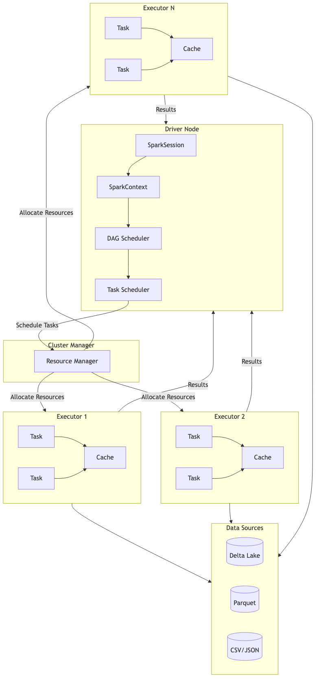
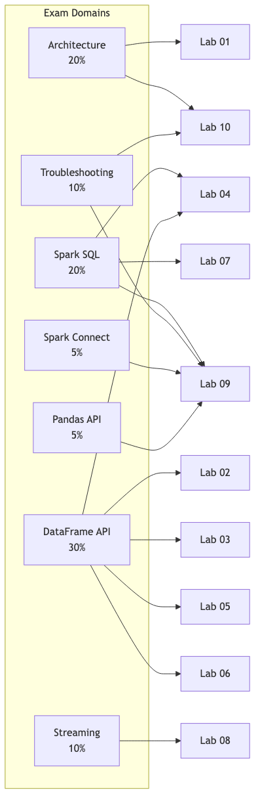
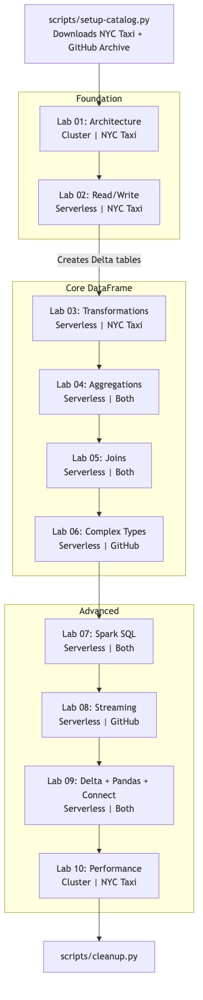

# Databricks Spark Associate Lab Guide

10 hands-on labs for the **Databricks Certified Associate Developer for Apache Spark** exam. Original content using public datasets (NYC Taxi, GitHub Archive), covering all 7 exam domains.



## Labs

| # | Lab | Exam Domains | Compute | Time | Cost |
|---|-----|-------------|---------|------|------|
| 01 | [Spark Architecture & Cluster Exploration](labs/01-spark-architecture-cluster-exploration.ipynb) | Architecture (20%) | Cluster | 25 min | $1-2 |
| 02 | [Reading & Writing Data Formats](labs/02-reading-writing-data-formats.ipynb) | DataFrame API (30%) | Serverless | 30 min | $1 |
| 03 | [DataFrame Transformations & Actions](labs/03-dataframe-transformations-actions.ipynb) | DataFrame API (30%) | Serverless | 35 min | $1 |
| 04 | [Aggregations & Grouping](labs/04-aggregations-grouping.ipynb) | DataFrame API (30%), SQL (20%) | Serverless | 35 min | $1 |
| 05 | [Joins & Set Operations](labs/05-joins-set-operations.ipynb) | DataFrame API (30%) | Serverless | 35 min | $1 |
| 06 | [Complex Data Types & JSON](labs/06-complex-data-types-json.ipynb) | DataFrame API (30%) | Serverless | 30 min | $1 |
| 07 | [Spark SQL, Views & Catalog](labs/07-spark-sql-views-catalog.ipynb) | SQL (20%) | Serverless | 35 min | $1-2 |
| 08 | [Structured Streaming](labs/08-structured-streaming.ipynb) | Streaming (10%) | Serverless | 35 min | $1-2 |
| 09 | [Delta Lake, Pandas API & Spark Connect](labs/09-delta-lake-pandas-api-spark-connect.ipynb) | SQL (20%), Pandas API (5%), Spark Connect (5%), Troubleshooting (10%) | Serverless | 30 min | $1 |
| 10 | [Performance Tuning & Spark UI](labs/10-performance-tuning-spark-ui.ipynb) | Troubleshooting (10%), Architecture (20%) | Cluster | 40 min | $2-3 |

**Total: ~5.5 hours | ~$10-15**

## Exam Domain Coverage



| Domain | Weight | Labs |
|--------|--------|------|
| Apache Spark Architecture and Components | 20% | 01, 10 |
| Using Spark SQL | 20% | 04, 07, 09 |
| Developing DataFrame/DataSet API Applications | 30% | 02, 03, 04, 05, 06 |
| Troubleshooting and Tuning DataFrame API Apps | 10% | 09, 10 |
| Structured Streaming | 10% | 08 |
| Using Spark Connect to deploy applications | 5% | 09 |
| Using Pandas API on Apache Spark | 5% | 09 |

## Getting Started

1. **Check prerequisites:** Review [prerequisites.md](prerequisites.md) and run:
   ```bash
   bash scripts/check-prerequisites.sh
   ```

2. **Set up data and catalog:** Run the setup script once:
   ```bash
   python scripts/setup-catalog.py
   ```

3. **Work through labs:** Open the notebooks in your Databricks workspace and run them in order (01 → 10).

4. **Clean up when done:**
   ```bash
   python scripts/cleanup.py
   ```



## Lab Progression

Labs are designed to be completed in order. Lab 02 creates Delta tables used by all subsequent labs.

- **Labs 01-02:** Foundation — architecture, data I/O
- **Labs 03-06:** Core DataFrame API — transformations, aggregations, joins, complex types
- **Labs 07-10:** Advanced — SQL, streaming, Delta Lake, performance tuning

## Supporting Materials

- **[Cheatsheets](cheatsheets/):** Three concise, commented notebooks for exam-day reference
  - [DataFrame API](cheatsheets/dataframe-api-cheatsheet.ipynb)
  - [Spark SQL & Delta Lake](cheatsheets/spark-sql-delta-cheatsheet.ipynb)
  - [Streaming & Performance](cheatsheets/streaming-performance-cheatsheet.ipynb)
- **[Cost Guide](COST-GUIDE.md):** Detailed cost breakdown per lab and tips to minimize spend
- **[Prerequisites](prerequisites.md):** Setup requirements and authentication guide

## Target Audience

Certification candidates with:
- Python competency
- Basic understanding of distributed computing concepts
- Access to a Databricks workspace (pay-as-you-go or trial with Unity Catalog)

## Datasets

| Dataset | Source | Format | License |
|---------|--------|--------|---------|
| [NYC Taxi Trip Records](https://www.nyc.gov/site/tlc/about/tlc-trip-record-data.page) | NYC TLC | Parquet | Public |
| [GitHub Archive](https://www.gharchive.org/) | GH Archive | JSON (gzipped) | Public Domain |

Both datasets are downloaded by the setup script — nothing is bundled in this repository.

## License

[MIT](LICENSE) — Bruno Triani, 2026
